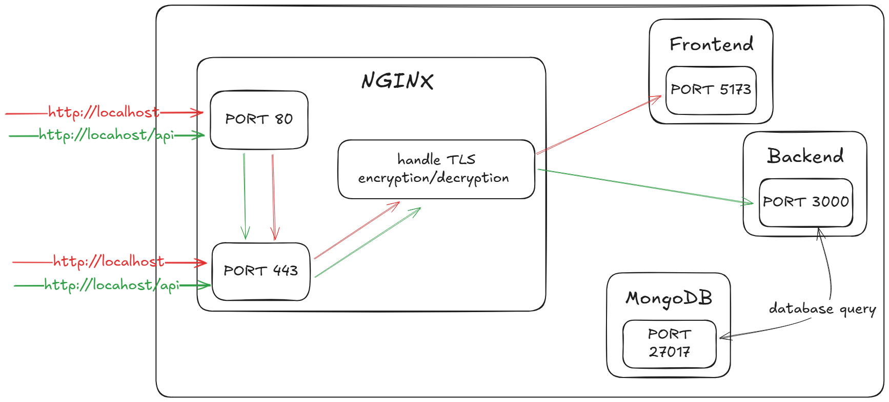

# MERN Stack Kanban Board

A **full-stack Kanban board application** built with the MERN stack (MongoDB, Express, React, Node.js) to manage tasks and workflows efficiently. This project implements both frontend and backend services, featuring authentication, task management, and drag-and-drop functionality.

---

## 🎥 Preview

Check out the preview of the application:

<video width="600" controls>
  <source src="https://github.com/user-attachments/assets/8b1e05ea-121a-4f59-8cc3-d74b0f9b983c" type="video/mp4">
  Your browser does not support the video tag.
</video>

## 🗂️ File Structure

The project is organized into four main directories: `frontend`, `backend`,`infrastructure`, and `scripts`.

### **Backend** (`/backend`)
The backend is a Node.js application using Express to manage API routes and services.

#### **Key Files**
- **`Dockerfile.dev`**: Dockerfile for development environment setup.
- **`src/`**: Main source directory:
  - **`app.ts`**: Configures the Express application, adding middleware and routes.
  - **`config/`**: Contains configuration files (e.g., database connections).
  - **`controllers/`**: Handles API requests and responses.
  - **`middleware/`**: Middleware for authentication and other tasks.
  - **`models/`**: Mongoose schemas and models.
  - **`routes/`**: Defines API routes and maps them to controllers.
  - **`services/`**: Business logic and reusable functionalities.
  - **`utils/`**: Utility functions and helpers.
- **`tests/`**: Unit and integration tests for the backend (for now, there just tests related to authentification).

### **Frontend** (`/frontend`)
The frontend is a React application built with TypeScript and styled using Material-UI. It includes Redux for both local and server states management and utilizes hooks for reusability.

#### **Key Files**
- **`Dockerfile.dev`**: Dockerfile for development environment setup.
- **`src/`**: Main source directory:
  - **`assets/`**: Static files such as images and fonts.
  - **`components/`**: Reusable React components.
  - **`context/`**: React Contexts for global state management.
  - **`hooks/`**: Custom hooks for reusable logic.
  - **`pages/`**: Page components for different routes.
  - **`services/`**: API services and utility functions.
  - **`redux/`**: Manages application state with Redux Toolkit.
  - **`types/`**: Includes TypeScript type definitions.
  - **`utils/`**: Helper functions.

### **Infrastructure** (`/infrastructure`)
The infrastructure folder contains configuration and deployment files.

#### **Key Files**
- **`docker/`**: Docker-related configuration files.
- **`nginx/`**: Nginx configuration files for serving the application.
- **`tls/`**: TLS/SSL certificates for secure connections.

### **Scripts** (`/scripts`)
The scripts folder contains automation scripts for various tasks.

#### **Key Files**
- **`linux/`**: Scripts for Linux systems.
- **`win/`**: Scripts for Windows systems.

---

## 🚀 Features
- **Task Management**: Add, edit, and delete tasks in different sections.
- **Drag and Drop**: Seamlessly move tasks across sections using intuitive drag-and-drop functionality.
- **User Authentication**: Secure login and token-based authentication, including support for Google Authentication.
- **Responsive Design**: TO DO
- **Persistent Sessions**: Utilize refresh tokens to maintain user sessions securely.
- **Environment-Specific Builds**: Separate environments for development, testing, and production using Docker and environment variables.

---

## 🛠️ Technologies Used

### **Frontend**
- **React** (with TypeScript): Component-based UI development.
- **Redux Toolkit**: State management
- **RTK Query**: Data fetching and caching
- **Material-UI**: Component styling
- **dnd-kit**: Drag-and-drop functionality
- **React Hook Form**: Form handling and validation
- **Zod**: Schema-based validation
- **Vite**: Development server and build tool
- **Axios**: Simplified HTTP requests and API handling.

### **Backend**
- **Node.js**: Server-side JavaScript runtime environment.
- **Express.js**: Minimal and flexible web application framework.
- **MongoDB**: NoSQL database for scalable data storage.
- **Mongoose**: ODM library for MongoDB, managing data models and schemas.
- **JSON Web Tokens (JWT)**: Secure token-based authentication.
- **Google Auth Library**: OAuth 2.0 implementation for secure Google Authentication.
- **Zod**: Schema-based validation for request data
- **Jest**: JavaScript testing framework for unit and integration tests.
- **Supertest**: HTTP assertions for API testing.

### **Infrastructure & DevOps**
- **Docker**: Containerization for consistent development and deployment environments.
- **Nginx**: Reverse proxy and load balancing.
- **GitHub Actions**: Continuous Integration and Deployment (CI/CD).
- **TLS/SSL**: Secure communication using certificates.

---

## 🌐 Network Flow Diagram

This diagram illustrates the network flow for the application, showing how HTTP/HTTPS requests are routed between components.


### Description
1. **HTTP/HTTPS Requests**:
   - All HTTP requests sent to port `80` are redirected to HTTPS on port `443`.
   - HTTPS requests on port `443` are handled by NGINX.
2. **Frontend**:
   - NGINX routes requests for the React application to the frontend container (`kanban_frontend`) on port `5173`.
3. **Backend**:
   - API requests (`/api/*`) are proxied by NGINX to the backend container (`kanban_backend`) on port `3000`.
4. **Database**:
   - The backend interacts with the MongoDB database (`kanban_database`) on port `27017` for data storage and retrieval.

---

## 📝 Development Guide

### **Prerequisites**
Ensure you have the following installed on your system:
- **Node.js** (JavaScript runtime)
- **Docker** (for containerized development)
- **MongoDB** (local or use a cloud service like MongoDB Atlas)
- **npm** or **yarn** (for dependency management)
- **Git** (for version control)

### **Clone the Repository**
```
git clone https://github.com/phantranthienan/kanban-board.git
cd kanban-board
```

Follow these steps to set up and run the project in your local development environment.

### **1. Run Separately with `npm run dev`**

#### **Backend Setup**

1. Navigate to the backend folder: `cd backend`

2. Install dependencies: `npm install`

3. Set up the environment variables:
   - Create a `.env` file in the `backend` directory.
   - Add the following variables:

     ```env
     PORT=3000
     MONGODB_URI_DEV=mongodb://localhost:27017/kanban
     CORS_ORIGINS=http://localhost:5173
      FRONTEND_URL=http://localhost:5173
     JWT_SECRET=your_jwt_secret
     JWT_REFRESH_SECRET=your_jwt_refrest_secret
     GOOGLE_CLIENT_ID=your_google_client_id
     GOOGLE_CLIENT_SECRET=your_google_client_secret
     GOOGLE_REDIRECT_URI=http://localhost:3000/api/auth/google/callback
     ```

4. Start the development server: `npm run dev`

#### **Frontend Setup**

1. Navigate to the frontend folder: `cd frontend`

2. Install dependencies: `npm install`

3. Set up the environment variables:
   - Create a `.env.developement` file in the `frontend` directory.
   - Add the following variables:

     ```env
     VITE_API_URL=http://localhost:3000/api
     ```

4. Start the development server: `npm run dev`

### **2. Run Using Scripts**

This approach simplifies development using Docker and automated scripts for setup and teardown.

#### **Windows**

1. Navigate to the `scripts/win` directory: `cd scripts/win`

2. Generate TLS/SSL certificates: `./generate_tls.sh`

3. Start the development environment: `./dev.sh run`

4. To stop and clean up resources:
```
   ./dev.sh stop  
   ./dev.sh clean
```

#### **Linux**

1. Navigate to the `scripts/linux` directory: `cd scripts/linux`

2. Generate TLS/SSL certificates: `bash generate_tls.sh`

3. Start the development environment: `bash dev.sh run`

4. To stop and clean up resources:
```
   bash dev.sh stop  
   bash dev.sh clean
```

---

## 👤 Author

- **Phan Tran Thien An**
- 📧 Email: [phantranthienan1405@gmail.com](mailto:phantranthienan1405@gmail.com)
